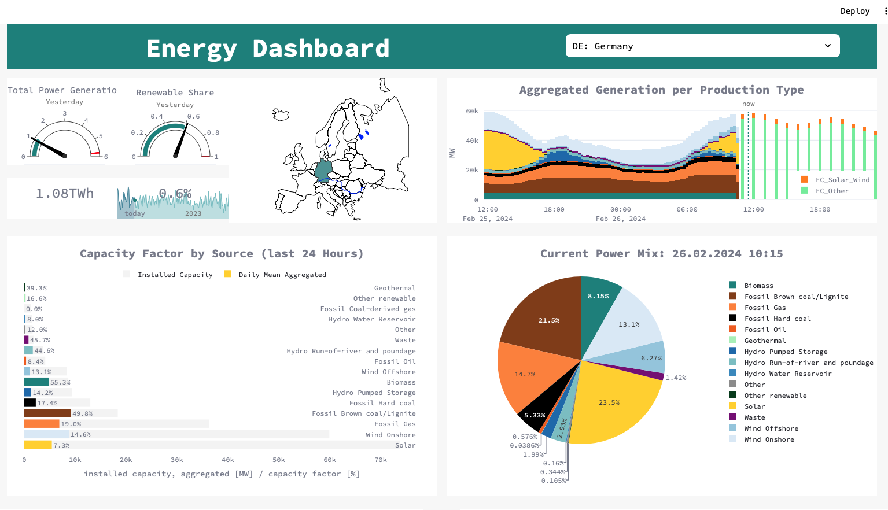

# energy-dashboard

This is a project to visualize real time electricity generation data  for the pan-European market obtained from 
[ENTSOE](https://transparency.entsoe.eu/content/static_content/Static%20content/web%20api/Guide.html) and [Energy_Charts](https://api.energy-charts.info)

A streamlit, plotly, pandas, httpx/ trio (async requests) project.

-- under construction -- 