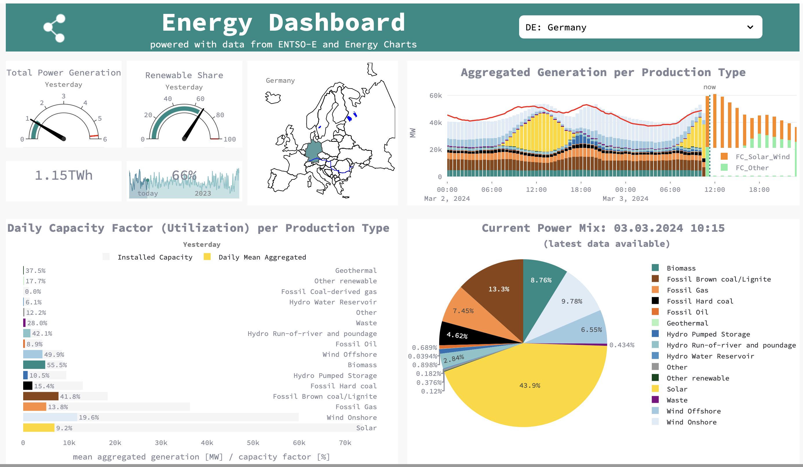

# energy-dashboard

A project to visualize near real time power generation data for the pan-European market obtained from 
[ENTSO-E](https://transparency.entsoe.eu/content/static_content/Static%20content/web%20api/Guide.html) and [Energy_Charts](https://api.energy-charts.info)

A streamlit, plotly, pandas, httpx/ trio (async requests) project.

-- under construction -- 

>**Note:** see also a precursory app with slightly different setup (user sign-up, RDS database, prefect workflow, IaC with pulumi and GitLab CI) on GitLab:
https://gitlab.com/personal_projects7594544/App2/-/tree/main
